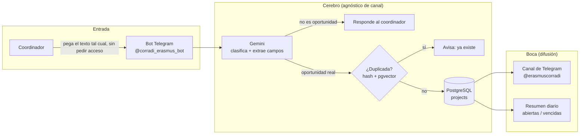

# CORRADI-BOT

**Difusión automática de oportunidades Erasmus+ para jóvenes, sobre Telegram.**


Proyecto Erasmus+ **KA210-YOU** (Proactive Future + LIFE Rumanía + DreamTeam Grecia).
Convierte las oportunidades de movilidad juvenil que hoy circulan sueltas y a mano (Kosmos,
Instagram, grupos de WhatsApp...) en una **base de datos estructurada** que se difunde sola,
sin intervención humana en el día a día.

---

## Índice

- [Idea central](#idea-central-separar-el-cerebro-de-la-boca)
- [Flujo de datos](#flujo-de-datos)
- [El bot: @corradi_erasmus_bot](#el-bot-corradi_erasmus_bot)
- [Anti-abuso](#anti-abuso)
- [Stack](#stack-alineado-con-la-propuesta-financiada)
- [Estructura del repo](#estructura-del-repo)
- [Puesta en marcha](#puesta-en-marcha)
- [Producción (AWS EC2)](#producción-aws-ec2--ya-desplegado)
- [Configuración (`.env`)](#configuración-env)
- [Resumen diario](#resumen-diario)
- [Resumen semanal](#resumen-semanal)
- [Bandera de país](#bandera-de-país-en-cada-post)
- [Calidad de extracción](#calidad-de-extracción--aprendido-con-mensajes-reales)
- [Qué está aparcado (WhatsApp)](#qué-está-aparcado-whatsapp)
- [Pendiente / siguientes bloques](#pendiente--siguientes-bloques)

---

## Idea central: separar el "cerebro" de la "boca"



- **Cerebro**: captura → clasificación + extracción con LLM → deduplicación → BD estructurada.
  Es el activo que escala a otros países y canales; no sabe nada de Telegram en sí.
- **Boca** (adaptadores enchufables): hoy **Telegram**, 100% automático. Mañana: web/PWA,
  mapa, app móvil, y WhatsApp si vuelve a ser viable (ver [más abajo](#qué-está-aparcado-whatsapp)).

**Lanzamiento: 100% Telegram.** Los Canales de difusión de WhatsApp no tienen API de
publicación (solo se puede publicar a mano, incluso siendo admin), así que WhatsApp queda
aparcado para esta fase.

## Flujo de datos

1. Un **coordinador** le pega al bot el mensaje de una oportunidad tal cual lo tenga (Kosmos,
   Instagram, lo que sea — no hace falta limpiarlo ni pedir acceso antes). **Una oportunidad
   por mensaje** (si el texto trae varios proyectos a la vez, el bot pide que se separen).
2. Gemini decide si es una oportunidad real y extrae los campos (título, tipo, fechas, país,
   deadline, formulario…). Si no trae deadline explícita, se estima **+5 días** (**+2 días**
   si el mensaje dice "última hora"/"últimas plazas"). Si una fecha no trae año, se asume el
   próximo futuro (nunca en el pasado).
3. **Control de plazo:** si la fecha límite que trae el mensaje **ya ha pasado**, la
   oportunidad no se publica: el bot responde a quien la mandó avisándole de que está fuera
   de plazo (se registra como `expired` en `submissions`). Y si la deadline final cae **a más
   de 3 meses vista** (`MAX_DEADLINE_MONTHS`), tampoco se publica — suele ser un año mal
   inferido (p.ej. "17/07" sin año, procesado después del 17 de julio) — se registra como
   `deadline_too_far` y se pide revisar el mensaje.
4. Deduplicación: hash exacto (título+país+fecha) + similitud coseno (pgvector) sobre el
   embedding del mensaje completo.
5. Se guarda en `projects` con un identificador legible (`CORRADI-2026-0001`) — es **interno**,
   no se muestra al coordinador ni en el canal; solo se usa en BD/API.
6. Se publica **automáticamente**, sin intervención humana, en el canal de Telegram
   [@erasmuscorradi](https://t.me/erasmuscorradi).
7. Cada día a las 20h, un resumen (ver [Resumen diario](#resumen-diario)) lista **todas las
   oportunidades con inscripción abierta** (no solo las de ese día) y expira lo vencido.

No hay paso de aprobación manual antes de publicar: si el LLM la valida como oportunidad
real y no es un duplicado, sale al canal directamente.

## El bot: `@corradi_erasmus_bot`

No hace falta memorizar comandos: **basta con pegarle el texto de la oportunidad como
mensaje normal** y el bot hace el resto (clasificar, extraer, deduplicar, publicar).

### Acceso — abierto por defecto

Cualquiera puede escribirle al bot y mandar oportunidades directamente, **sin pedir permiso
antes**. El único filtro es reactivo: si Pachu (@pachums97) detecta un problema con alguien,
se le bloquea a mano; y el propio bot bloquea solo a quien haga spam (ver
[Anti-abuso](#anti-abuso)).

| Comando | Qué hace |
|---|---|
| `/start` | Explica cómo funciona el bot |
| `/ayuda` | Reglas de uso + enlace al canal de difusión |
| `/buscar <palabra>` | Busca entre las oportunidades abiertas (país, tema, título...) |
| `/misenvios` | Cuántas has mandado hoy (de las 3) y tu historial reciente |
| `/id` | Tu ID numérico de Telegram (útil si hay que desbloquearte a mano) |
| `/privacidad` | Política de privacidad |

`/id` y `/privacidad` siguen funcionando pero ya no aparecen listados en `/ayuda` (para no
saturarla) — solo se usan si hace falta. No hay comandos de administración en el bot —
bloquear o desbloquear a alguien se hace directamente en la base de datos (tabla
`blocked_users`), no vía un comando expuesto. Los **admins** (`ADMIN_TELEGRAM_IDS`) no tienen
límite diario ni pueden auto-bloquearse por spam.

## Anti-abuso

Para que el canal no se llene de spam ni de mensajes fuera de sitio:

- **Máximo `MAX_DAILY_OPPORTUNITIES` oportunidades al día por persona** (3 por defecto), salvo
  admins (`ADMIN_TELEGRAM_IDS`), que no tienen límite. Al superarlo, el bot responde pidiendo
  que se reintente al día siguiente — no llega a llamar al LLM, así que tampoco cuesta nada.
- **Sistema de 2 avisos**: si un mensaje no es una oportunidad, el bot avisa (⚠️). Si el
  *siguiente* mensaje de esa misma persona **tampoco** lo es, se bloquea el acceso
  automáticamente y se avisa a los admins por Telegram — el bloqueo es indefinido, se
  levanta a mano en la base de datos. Cualquier envío bueno de por medio resetea el contador.
  El umbral es `SPAM_BLOCK_THRESHOLD` (2 por defecto). Los admins tampoco están sujetos a
  este sistema.
- **Todo envío queda registrado** en la tabla `submissions` (creada, duplicada, no-oportunidad,
  límite superado, error), con el ID de Telegram de quien lo mandó — es la base de datos que
  usan las dos reglas anteriores, y también sirve de auditoría si hace falta revisar quién
  mandó qué.

## Stack (alineado con la propuesta financiada)

| Pieza | Uso |
|---|---|
| **PostgreSQL 16 + pgvector** | Catálogo de oportunidades + dedup semántico por embedding |
| **Redis** | Reservado para caché/colas futuras |
| **FastAPI** | API de solo lectura: catálogo y búsqueda (`/opportunities`) |
| **python-telegram-bot** | Captura (DM) y publicación (canal) |
| **Google Gemini** (`gemini-2.5-flash-lite` + `gemini-embedding-001`) | Clasificación, extracción de campos, embeddings |
| **Docker Compose** | Mismo despliegue en local y en EC2 |

## Estructura del repo

```
corradi/
├── docker-compose.yml          # db (pgvector) + redis + api + bot
├── db/migrations/               # esquema (0001) + submissions/tracking (0002)
├── docker/                     # api.Dockerfile, bot.Dockerfile
├── run_bot.py                  # entrypoint del bot
├── terraform/                  # EC2 t4g.small + Docker (IaC, fase 0 de despliegue)
├── docs/
│   ├── mensajes_ejemplo.md     # corpus real (13 mensajes), para medir calidad de extracción
│   ├── privacidad.md
│   └── archive/                # guías de WhatsApp (Twilio/Meta Cloud), aparcadas
├── tests/                      # pytest, no necesitan BD ni claves (LLM_PROVIDER=fake)
└── app/
    ├── config.py                # toda la config vía variables de entorno (.env)
    ├── domain/
    │   ├── project.py           # parseo de campos del LLM, hash de dedup, red de seguridad de fechas
    │   └── project_type.py      # enums (YOUTH_EXCHANGE, TRAINING_COURSE, VOLUNTEERING, WORKSHOP)
    ├── db/
    │   ├── pool.py               # pool async (psycopg3) + adaptador pgvector
    │   └── repository.py         # oportunidades + lista blanca + solicitudes + tracking de envíos
    ├── llm/
    │   ├── prompts.py             # prompt de clasificación + extracción
    │   ├── extractor.py           # llama a Gemini, normaliza la respuesta
    │   ├── embeddings.py          # embeddings para dedup semántico
    │   ├── retry.py               # reintentos con backoff ante 503 de Gemini
    │   └── fake.py                 # extracción heurística para dry-run (LLM_PROVIDER=fake)
    ├── pipeline.py                # clasifica → deduplica → guarda → publica → handoff (agnóstico de canal)
    ├── publisher/
    │   ├── telegram_publisher.py   # formatea y publica en el canal
    │   ├── handoff.py               # despachador de handoff (hoy: none)
    │   ├── whatsapp_twilio.py       # ⚠️ aparcado
    │   └── whatsapp_cloud.py        # ⚠️ aparcado
    ├── bot/telegram_bot.py         # comandos + captura de mensajes
    ├── api/
    │   ├── main.py                  # FastAPI: catálogo/búsqueda
    │   └── twilio_webhook.py        # ⚠️ aparcado (entrada por WhatsApp)
    └── scheduler/
        ├── daily_summary.py         # resumen diario (programado por cron, ver abajo)
        └── weekly_summary.py        # resumen semanal de los domingos
```

## Puesta en marcha

### Todo en Docker (igual en local y en EC2)

```bash
cp .env.example .env     # rellena TELEGRAM_BOT_TOKEN, GEMINI_API_KEY, ADMIN_TELEGRAM_IDS…
make up                  # docker compose up -d --build
make logs
```
- API en http://localhost:8000  (`/health`, `/opportunities`, `/opportunities/{id}`)
- La BD se inicializa con los scripts de `db/migrations/` (pgvector + tablas) — pero
  **solo la primera vez** que se crea el volumen de Postgres. Si añades una migración nueva
  sobre una BD que ya existe, aplícala a mano:
  ```bash
  docker exec -i corradi-db psql -U corradi -d corradi < db/migrations/000X_nombre.sql
  ```

Tras cambiar `.env` (token, canal…), reconstruye y recrea el contenedor afectado:
```bash
docker compose build bot && docker compose up -d --force-recreate bot
```

### Desarrollo de la app en local (BD/Redis en Docker)

```bash
make dev-db              # solo db + redis
make install
make bot                 # bot de captura
make api                 # API con reload
make summary             # resumen diario (probar a mano)
```

### Sin BD ni claves (dry-run)

```bash
make test                # tests con LLM_PROVIDER=fake (extracción heurística)
make demo                # flujo completo offline
make seed                # carga ejemplos en la BD (necesita 'make dev-db')
```

## Producción (AWS EC2) — YA DESPLEGADO

El bot corre **24/7 en una EC2 t4g.small** (Ubuntu 24.04 ARM), provisionada con el Terraform
de `terraform/`. Todo el stack (db + redis + api + bot) corre en Docker Compose, igual que en
local.

| Dato | Valor |
|---|---|
| IP pública (elástica, estable) | `52.49.142.64` |
| Entrar por SSH | `ssh ubuntu@52.49.142.64` |
| Ruta del proyecto en la instancia | `/opt/corradi` |
| Región | `eu-west-1` |
| Coste | **0 € hasta 31-dic-2026** (free trial), luego ~17-19 €/mes |

**Resiliencia**: los contenedores usan `restart: unless-stopped` y Docker arranca al bootear,
así que todo vuelve solo tras un reinicio o si un contenedor se cae. Los cron (diario 20:00,
semanal domingos 20:30) están en el `crontab` de la instancia, que está en hora de Madrid.

> ⚠️ **No arranques el bot en local mientras el de AWS esté vivo**: los dos competirían por
> el mismo token de Telegram (solo un proceso puede hacer *polling*) y fallarían de forma
> intermitente. El entorno local quedó parado a propósito (sirve de respaldo).

### Operar / ver info en la instancia

```bash
ssh ubuntu@52.49.142.64
cd /opt/corradi
docker ps                              # estado de los contenedores
docker logs corradi-bot --tail 50 -f   # logs del bot en vivo
docker exec corradi-db psql -U corradi -d corradi -c \
  "SELECT identifier, title, status FROM projects ORDER BY created DESC;"
```

La API (puerto 8000) está cerrada a internet. Para verla, túnel SSH desde tu Mac:
```bash
ssh -L 8000:localhost:8000 ubuntu@52.49.142.64
# luego en el navegador: http://localhost:8000/opportunities
```

### Flujo de edición y despliegue

1. **Editas en local** (`app/…`).
2. **Pruebas** en local: `make test` (o `make demo` para el flujo offline sin claves).
3. **Subes a AWS** con rsync y reconstruyes solo el/los servicio(s) afectados:
   ```bash
   cd /Users/pachu/Desktop/personal/corradi
   rsync -a --exclude .git --exclude .venv --exclude '__pycache__' \
     --exclude '.pytest_cache' --exclude 'terraform/.terraform' \
     ./ ubuntu@52.49.142.64:/opt/corradi/
   ssh ubuntu@52.49.142.64 'cd /opt/corradi && docker compose up -d --build bot'
   ```
4. **Verificas**: `ssh ubuntu@52.49.142.64 'docker logs corradi-bot --tail 10'`.

> El `.env` **no** se sube con cada cambio (rsync no lo trae de vuelta ni lo pisa salvo que
> lo copies a mano). Si cambias variables de entorno, cópialo aparte con `scp .env
> ubuntu@52.49.142.64:/opt/corradi/.env` y recrea el contenedor.

## Configuración (`.env`)

Variables imprescindibles para el lanzamiento actual (ver `.env.example` para el resto):

| Variable | Para qué |
|---|---|
| `TELEGRAM_BOT_TOKEN` | Token del bot (@corradi_erasmus_bot) |
| `TELEGRAM_CHANNEL_ID` | Canal de difusión, formato `-100...` (hoy: `@erasmuscorradi`) |
| `ADMIN_TELEGRAM_IDS` | IDs numéricos de Telegram con permisos de admin, separados por coma |
| `GEMINI_API_KEY` | Clave de Google Gemini |
| `HANDOFF_MODE` | `none` en el lanzamiento actual (WhatsApp aparcado) |
| `DEFAULT_DEADLINE_DAYS` | Días de margen si no hay deadline explícita en el texto (5 por defecto) |
| `LAST_MINUTE_DEADLINE_DAYS` | Igual, pero si el mensaje dice "última hora"/"últimas plazas" (2 por defecto) |
| `MAX_DEADLINE_MONTHS` | Solo se aceptan oportunidades cuya deadline caiga dentro de estos meses (3 por defecto; red de seguridad ante años mal inferidos) |
| `MAP_DOMAIN` | Dominio del mapa público; Caddy pide el certificado HTTPS para este nombre (vacío = HTTP sin TLS) |
| `MAP_PUBLIC_URL` | URL que enlaza el resumen diario al final (vacío = no se enlaza) |
| `DEDUP_THRESHOLD` | Umbral de similitud coseno para considerar duplicado (0.88 por defecto) |
| `TELEGRAM_CHANNEL_USERNAME` | Username público del canal (sin @); enlaza cada post del resumen diario a su mensaje original |
| `MAX_DAILY_OPPORTUNITIES` | Máximo de oportunidades que puede crear un coordinador al día (3 por defecto) |
| `SPAM_BLOCK_THRESHOLD` | Mensajes seguidos que no son oportunidad antes de bloquear automáticamente (2 por defecto: aviso + bloqueo) |

### Configurar el canal de difusión (referencia)

1. Añade al bot como **administrador** del canal, con permiso "Publicar mensajes".
2. Saca el `chat_id` numérico (para un canal público `@usuario`):
   ```
   GET https://api.telegram.org/bot<TOKEN>/getChat?chat_id=@usuario
   ```
3. Ponlo en `.env` como `TELEGRAM_CHANNEL_ID` (formato `-100...`).

## Resumen diario

`app/scheduler/daily_summary.py` expira lo vencido (una oportunidad expira el mismo día en
que llega su fecha límite, no al día siguiente) y publica en el canal, cada día a las 20h,
un resumen de **todas las oportunidades cuya inscripción sigue abierta** — no solo las
recibidas ese día, sino todo lo vigente, y nunca las expiradas/cerradas — con cabecera de fecha. Cada título enlaza directamente al post original en el canal
(`https://t.me/<usuario>/<message_id>`, posible porque el canal es público) — así se
encuentra fácilmente en el historial aunque haya pasado tiempo. Si una oportunidad se
publicó antes de tener `TELEGRAM_CHANNEL_USERNAME` configurado, sale sin enlace (solo el
título en negrita, sin más). Formato por oportunidad (3 líneas):

```
📅 Resumen diario de oportunidades abiertas — 21 de julio de 2026

☀️ 2 oportunidades con inscripción abierta ahora mismo:

• Inclusion & Solidarity In Action
🏷️ ECS: Inclusion, Solidarity, Arts 🌍 Turin 📅 2026-09-01 → 2027-06-30
⏳ Fecha límite inscripción: 2026-07-26 (estimada: última hora)

• I'M POSSIBLE
🏷️ Youth Exchange: Adventure, personal development 🌍 Asturias 📅 2026-09-05 → 2026-09-15
⏳ Fecha límite inscripción: 2026-07-30
```

Programado con cron en el host (no dentro del contenedor, para que sobreviva a reinicios de
`docker compose`):
```bash
crontab -l   # ver/editar: 0 20 * * * docker exec corradi-bot python -m app.scheduler.daily_summary
```
> En local esto depende de que el Mac esté encendido a las 20h. En EC2, el mismo cron (o
> EventBridge Scheduler) corre 24/7 — mover el cron ahí es parte de la migración a producción.

## Mapa público

Mapa interactivo de las oportunidades **abiertas**, servido por la propia API en `GET /mapa`
(página autocontenida en `app/api/static/mapa.html`, Leaflet + teselas de CARTO/OpenStreetMap,
sin claves de API ni coste). El resumen diario lo enlaza al final si `MAP_PUBLIC_URL` está
definida.

**Qué hace:** pines por tipo (Youth Exchange azul · Training Course morado · ECS verde ·
Workshop naranja), filtros por texto, tipo, país y "cierran pronto" (≤7 días), lista lateral
sincronizada con el mapa (clic en tarjeta → vuela al pin y abre su ficha), badge de urgencia
("Cierra hoy", "Cierra en 3 días") y enlaces a inscripción, infopack y post original del canal.
Responsive y con modo claro/oscuro automático.

### Coordenadas

`app/geo.py` geocodifica en dos escalones y guarda el resultado en `projects.latitude/longitude`
(columnas que ya existían desde la migración inicial), así que cada ficha se geocodifica **una
sola vez**, al crearse:

1. **Ciudad exacta** vía Nominatim (OpenStreetMap): gratis, sin clave. Si el `location` es
   demasiado específico ("Manjirón, Sierra Norte de Madrid") reintenta con la primera parte.
2. **Centro del país** si no hay ciudad, si Nominatim no encuentra nada o si falla la red.
   Esos pines se marcan en la ficha como "Ubicación aproximada (país)".

Si todo falla, la oportunidad se publica igual en el canal; solo se queda fuera del mapa.

```bash
make backfill-geo   # geocodifica las fichas creadas antes de existir el mapa (1 req/s)
```

### Exposición pública y seguridad

La API **no** se expone directamente. Delante va **Caddy** (`docker/Caddyfile`), que da HTTPS
automático con Let's Encrypt y actúa de filtro:

| Decisión | Por qué |
|---|---|
| El contenedor `api` ya no publica el puerto 8000 al host | Todo el tráfico público entra por Caddy |
| Caddy solo deja pasar `/`, `/mapa`, `/api/map`, `/health` y `/opportunities*` | Cualquier otra ruta devuelve 404 |
| El webhook de Twilio solo se monta si `HANDOFF_MODE` es de WhatsApp | Con la API pública y `TWILIO_VALIDATE_SIGNATURE=false`, dejarlo montado permitiría a cualquiera hacer POST y colar oportunidades en el canal. Hoy `HANDOFF_MODE=none`, así que la ruta ni existe |
| La API serializa con **lista blanca** de campos (`_PUBLIC_FIELDS`) | `submitted_by`, `submitted_by_id`, `raw_message`, `hash` y `embedding` no salen nunca. Al ser lista blanca, una columna nueva no se filtra sola |

Variables: `MAP_DOMAIN` (dominio para el certificado) y `MAP_PUBLIC_URL` (lo que se enlaza en
el resumen). En Terraform, `expose_web = true` abre 80/443.

> El puerto 80 es imprescindible además del 443: Let's Encrypt lo usa para validar el dominio.

## Resumen semanal

`app/scheduler/weekly_summary.py` publica los domingos (20:30, media hora después del
diario) cuántas oportunidades nuevas se publicaron esa semana, cuántas siguen abiertas ahora
mismo, y el top de países y temáticas de lo publicado esa semana:

```
📊 Resumen semanal — 20 de julio al 21 de julio de 2026

✅ 6 oportunidades nuevas publicadas esta semana
☀️ 6 abiertas ahora mismo

🌍 Top países: 🇪🇸 España (2) · 🇩🇪 Alemania (2) · 🇧🇬 Bulgaria (1) · 🇮🇹 Italia (1)
🏷️ Top temáticas: Intercambio juvenil (3) · Training course (2) · Voluntariado (1)
```

```bash
crontab -l   # 30 20 * * 0 docker exec corradi-bot python -m app.scheduler.weekly_summary
make weekly-summary   # probarlo a mano
```

## Bandera de país en cada post

Cada oportunidad publicada en el canal lleva la **bandera del país** delante del título
(a partir de `country_code`, sin tabla que mantener — es una fórmula Unicode). Ver `_flag()`
en `app/publisher/telegram_publisher.py`.

## Calidad de extracción — aprendido con mensajes reales

`docs/mensajes_ejemplo.md` recoge un corpus real (13 mensajes) usado para validar el
extractor. Dos hallazgos de la última ronda de pruebas:

- **Fechas sin año** (p.ej. "19–27 septiembre"): el LLM podía inferir un año equivocado o
  pasado. **Corregido**: el prompt ahora recibe la fecha de hoy (`app/llm/prompts.py` +
  `extractor.py`) y, además, `app/domain/project.py` (`_future()`) empuja al año siguiente
  cualquier fecha que salga en el pasado — red de seguridad, porque estas son siempre
  convocatorias a futuro.
- **Un mensaje, varias oportunidades**: algunos coordinadores mandaban 2-3 proyectos
  distintos en un solo texto. Se ha decidido que **esto no debe ocurrir**: cada oportunidad
  se manda en su propio mensaje. Como red de seguridad, si aun así llega un texto con varias
  oportunidades (Gemini a veces lo detecta y devuelve una lista en vez de un objeto), el bot
  no falla: responde pidiendo que se reenvíen por separado, en vez de guardar una ficha
  incompleta o dar un error críptico.

## Qué está aparcado (WhatsApp)

El equipo decidió lanzar 100% en Telegram. El código de WhatsApp **no se ha borrado**,
solo está desactivado (`HANDOFF_MODE=none`) y marcado como aparcado en sus docstrings:

- `app/publisher/whatsapp_twilio.py` / `whatsapp_cloud.py` — envío saliente (handoff)
- `app/api/twilio_webhook.py` — entrada por WhatsApp (funcionó en sandbox con Twilio)
- `docs/archive/whatsapp_twilio_setup.md` / `whatsapp_cloud_setup.md` — guías de alta

Para reactivarlo: cambiar `HANDOFF_MODE` a `whatsapp_twilio` o `whatsapp_cloud` y seguir
la guía correspondiente en `docs/archive/`.

## Pendiente / siguientes bloques

- **Aviso de facturación en AWS** (Budgets) para enero-2027, cuando acabe el free trial.
- Quitar Redis del `docker-compose.yml` (configurado pero sin uso real en el código) para
  ahorrar RAM en la instancia. Ver [docs/infraestructura.md](docs/infraestructura.md).
- Catálogo web (Astro/React) + panel de moderación — A3 Fase 4.
- App móvil React Native + Expo — A3 Fase 5.
- Revisar si reactivar WhatsApp (chatbot 1:1 y/o handoff) más adelante.

> El análisis completo de infraestructura y coste (AWS vs Railway vs GCP/Oracle) está en
> [docs/infraestructura.md](docs/infraestructura.md).
